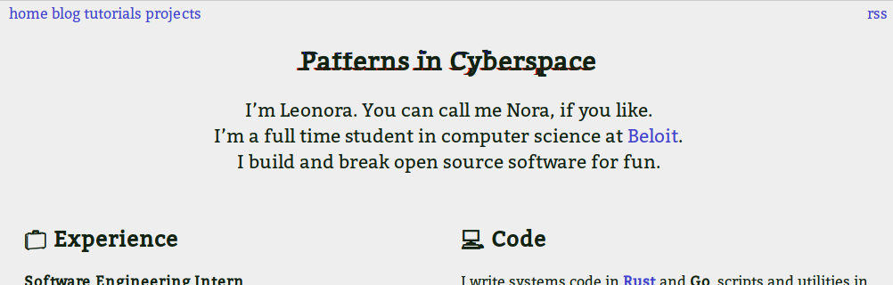

# nora.codes
## My personal blog's source code!

This is the source code for my personal website, at [nora.codes](https://nora.codes).
It is written in Markdown (and HTML/CSS for styling) with minimal JavaScript (just for
better syntax highlighting) and is built using Hugo, the Go static site generator.

